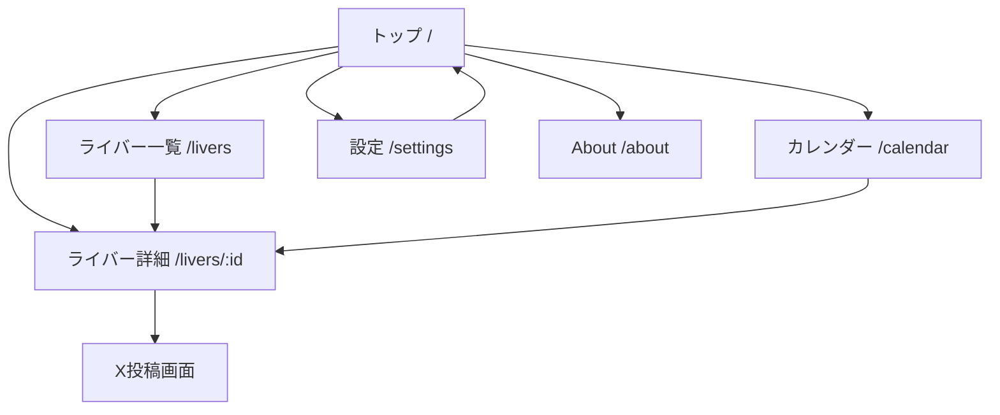

# 画面仕様・画面遷移

## 画面一覧

| パス | 画面 | 優先度 | 目的 |
| --- | --- | --- | --- |
| `/` | トップ | P0 | 今日の記念日、推し、近日記念日を見る |
| `/livers` | ライバー一覧 | P0 | 全ライバーを検索・比較する |
| `/livers/:id` | ライバー詳細 | P0 | 個別の経過日数と次の節目を見る |
| `/calendar` | カレンダー | P1 | 月単位で記念日を見る |
| `/settings` | 設定 | P1 | 表示条件と推し管理を調整する |
| `/about` | About | P0 | 非公式表記、データ基準、問い合わせ導線を見る |

## 画面遷移図



## トップ画面

### レイアウト

```text
[ヘッダー]
  サービス名 / 検索 / 設定

[今日の記念日]
  ライバーカード
  ライバーカード

[推し]
  推しカード
  推しカード

[近日記念日]
  日付ごとのリスト

[全ライバー検索]
  検索入力
  人気フィルター

[フッター]
  非公式表記 / データ基準 / ガイドラインリンク
```

### 今日の記念日

カードに表示する情報:

- ライバー名
- 節目ラベル
- デビュー日
- 経過日数
- 詳細ページへのリンク

節目ラベル例:

- `1,000日記念`
- `5周年`
- `半周年`

### 推し

推し登録済みライバーを最大6件表示します。6件を超える場合は横スクロールまたは一覧への導線を出します。

表示情報:

- ライバー名
- 今日で何日目か
- 次の節目まであと何日か
- 推し解除ボタン

### 近日記念日

標準では今日から30日以内の節目を日付順に表示します。

```text
6月18日
  〇〇 1,500日まであと3日

6月21日
  △△ 4周年まであと6日
```

## ライバー一覧

### レイアウト

デスクトップ:

- 左側にフィルター
- 右側に一覧

スマホ:

- 上部に検索
- フィルターはボトムシートまたは折りたたみ
- 一覧は縦カード

### カード表示

```text
[色チップ] ライバー名       [推し]
デビュー日: 2020/01/01
今日で: 2,359日目
次: 2,400日まであと41日
所属: JP / 〇〇期
```

## ライバー詳細

### ファーストビュー

```text
ライバー名
今日で 1,234日目
デビュー日 2022/12/31

次の記念日
1,250日まで あと16日
```

### セクション

- 基本情報
- 次の節目
- 近い節目一覧
- 公式リンク
- データ根拠
- 共有

### 共有導線

共有ボタンは目立ちすぎないが見つけやすい位置に置きます。

- Xで共有
- URLをコピー
- 共有文をコピー

## About画面

必須表示:

- 非公式ファンツールであること
- 公式・運営会社とは関係がないこと
- デビュー日の基準
- データ更新方針
- 参照元・問い合わせ先
- 権利・ガイドライン確認に関する案内

