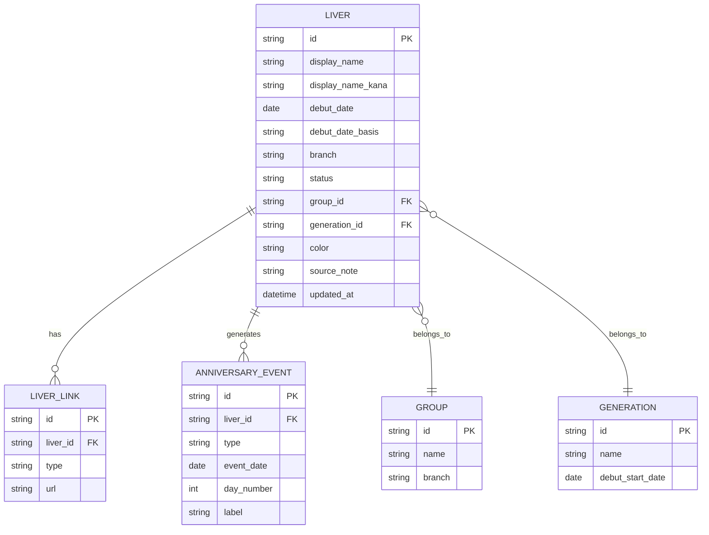

# データ設計

## 基本方針

MVPでは静的JSONで運用できる程度のシンプルなデータ構造にします。将来的に管理画面やAPI化へ移行できるよう、エンティティの境界は最初から分けます。

## ER図



## liver

| フィールド | 型 | 必須 | 説明 |
| --- | --- | --- | --- |
| `id` | string | yes | URLに使う安定ID |
| `display_name` | string | yes | 表示名 |
| `display_name_kana` | string | no | 検索補助 |
| `debut_date` | date | yes | デビュー基準日 |
| `debut_date_basis` | string | yes | 初配信日、公式発表日などの基準 |
| `branch` | string | yes | JP、ENなど |
| `status` | string | yes | active、graduated、pausedなど |
| `group_id` | string | no | グループID |
| `generation_id` | string | no | デビュー期ID |
| `color` | string | no | UIアクセント用カラー |
| `source_note` | string | no | データ根拠メモ |
| `updated_at` | datetime | yes | 最終更新日時 |

JSON例:

```json
{
  "id": "example-liver",
  "display_name": "〇〇",
  "display_name_kana": "まるまる",
  "debut_date": "2022-12-31",
  "debut_date_basis": "初配信日",
  "branch": "JP",
  "status": "active",
  "group_id": "example-group",
  "generation_id": "example-generation",
  "color": "#6B8AF7",
  "source_note": "公式プロフィールおよび初配信アーカイブを参照",
  "updated_at": "2026-06-15T00:00:00+09:00"
}
```

## anniversary_event

記念日は保存せず、基本的には `debut_date` から計算します。ただし、管理画面やカレンダー高速化が必要になった場合は事前生成テーブルとして持てるようにします。

| フィールド | 型 | 説明 |
| --- | --- | --- |
| `id` | string | イベントID |
| `liver_id` | string | ライバーID |
| `type` | string | day_milestone、yearly、half_yearなど |
| `event_date` | date | 記念日の日付 |
| `day_number` | int | 何日目か |
| `label` | string | 表示ラベル |

## ローカル保存

ブラウザ側では次の情報を保存します。

```json
{
  "favoriteLiverIds": ["example-liver"],
  "settings": {
    "upcomingDays": 30,
    "showGraduated": true,
    "theme": "system",
    "dayDisplayMode": "ordinal"
  }
}
```

## 日付計算

### 経過日数

```text
dayNumber = differenceInCalendarDays(todayJst, debutDateJst) + 1
```

例:

- デビュー日: 2026-06-15
- 今日: 2026-06-15
- 表示: 1日目

### 次の100日単位記念

```text
nextHundred = ceil(dayNumber / 100) * 100
if nextHundred == dayNumber:
  today is anniversary
```

### キリ番日数

3桁以上のキリ番日数は、計算ルールと設定値の両方で扱います。

```text
isHundredMilestone = dayNumber >= 100 and dayNumber % 100 == 0
isRepeatingDigit = dayNumber >= 100 and all digits are the same
isSpecialMilestone = dayNumber in specialDayMilestones
```

初期の特別キリ番:

```json
{
  "specialDayMilestones": [2434]
}
```

表示ラベル例:

- `300日記念`
- `333日記念`
- `1,000日記念`
- `2,434日記念`

### 周年

周年は日数ではなく暦日で扱います。

```text
yearlyDate = debutDate plus N years
```

2月29日デビューの扱いは実装時に明文化します。初期案では、うるう年でない年は2月28日を周年日として扱います。
