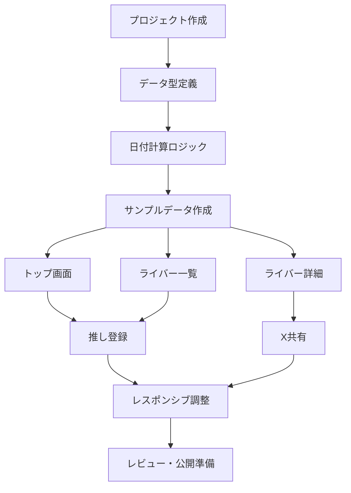

# MVPロードマップ

## フェーズ1: 仕様確定

成果物:

- 画面仕様
- データ仕様
- 記念日計算仕様
- 権利・運用方針
- MVP範囲

完了条件:

- 実装対象のP0機能が明確
- デビュー日の基準が決まっている
- データ項目が決まっている
- 非公式表記と素材方針が決まっている

## フェーズ2: プロトタイプ

実装範囲:

- トップ画面
- ライバー一覧
- ライバー詳細
- 静的JSON読み込み
- 日付計算
- 推し登録

技術候補:

- Vite + React + TypeScript
- Next.js
- Astro + React islands

初期は静的サイトとして運用しやすい構成が適しています。検索や推し登録はクライアント側で完結させます。

## フェーズ3: データ整備

作業:

- 初期ライバーデータを収集する
- デビュー日の基準を確認する
- 参照元メモを残す
- 卒業済みライバーの扱いを決める
- 表示確認を行う

注意:

- 最新の所属・活動状態は変わりやすいため、公開前に必ず確認する
- 公式情報を優先する
- 不確かなデータは未掲載または注記付きにする

## フェーズ4: 公開前レビュー

確認項目:

- スマホ表示で崩れない
- 日付計算が正しい
- 2月29日の扱いが明記されている
- 推し登録が保存される
- X共有文が意図通り生成される
- 非公式表記がある
- 公式画像・ロゴを使っていない
- データ修正導線がある

## フェーズ5: 初期公開

公開後に見ること:

- 誤データ報告
- よく使われる検索語
- 共有ボタン利用
- 推し登録率
- 直帰率
- スマホでの操作性

## 実装タスク分解

## 最初の実装チケット案

1. Vite + React + TypeScriptでプロジェクトを作成する
2. `Liver` 型とサンプルJSONを作成する
3. `calculateDayNumber` と `getUpcomingAnniversaries` を実装する
4. トップ画面に今日の記念日と近日記念日を表示する
5. ライバー一覧に検索・並び替えを実装する
6. 推し登録をローカルストレージで実装する
7. ライバー詳細ページと共有文生成を実装する
8. About画面に非公式表記とデータ基準を追加する
9. スマホ表示を調整する
10. 日付計算のテストを追加する

